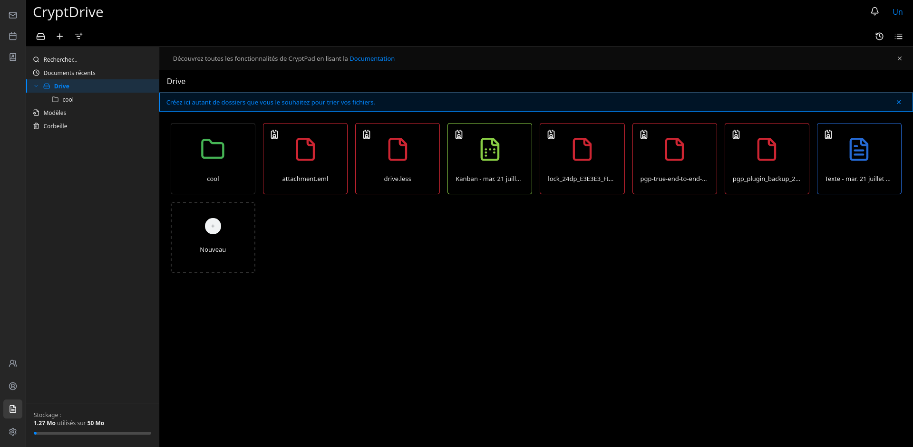
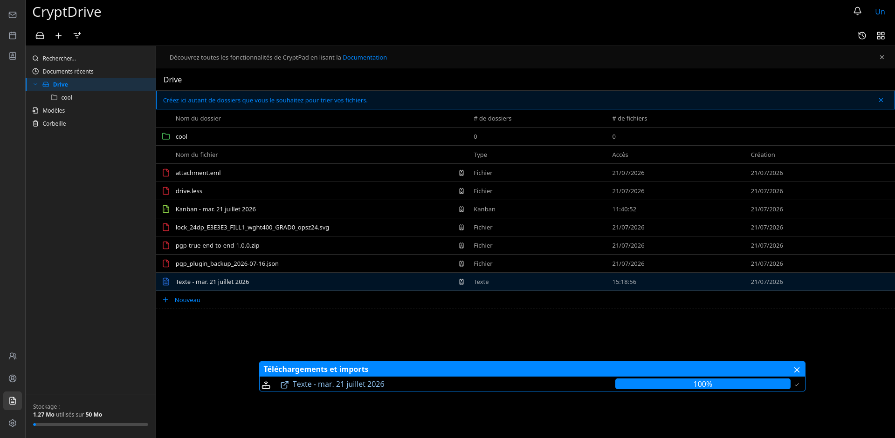
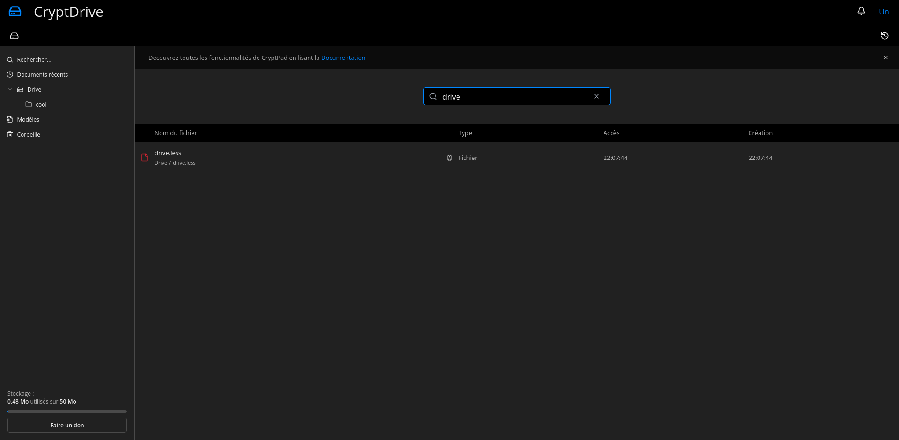

## Aurion Cryptpad Integration
If you don't know what is Cryptpad, see [here](https://cryptpad.org/).

This repo enable the integration with bulwark webmail. You must use SSO to login into Cryptad to make this works !
### Bulwark Integration

You must install the Bulwark [PGP Plugin](https://github.com/paulhenry46/pgp-plugin) and the [Cryptpad Bulwark Plugin](https://github.com/AurionMail/cryptpad_plugin). This allow users to derivate the secret used by Cryptpad to be 0 Knowledge from the default PGP key. In this way, they remebrer only their PGP passphrase and cryptpad is unlocked at same time.
## New Look And Feel
The Cryptpad team offers the possibility to customize the Look and Feel of the app, so here we go ! To install it, simply copy the content of `customize` into your root cryptpad installation, then restart service. If you don't like the theme, simply remove the folder and restart.
## Screenshots
The folowwing have been taken with default blue theme activated and Dark theme enabled. Be assured, it works in the same way with the others colors and theme.

